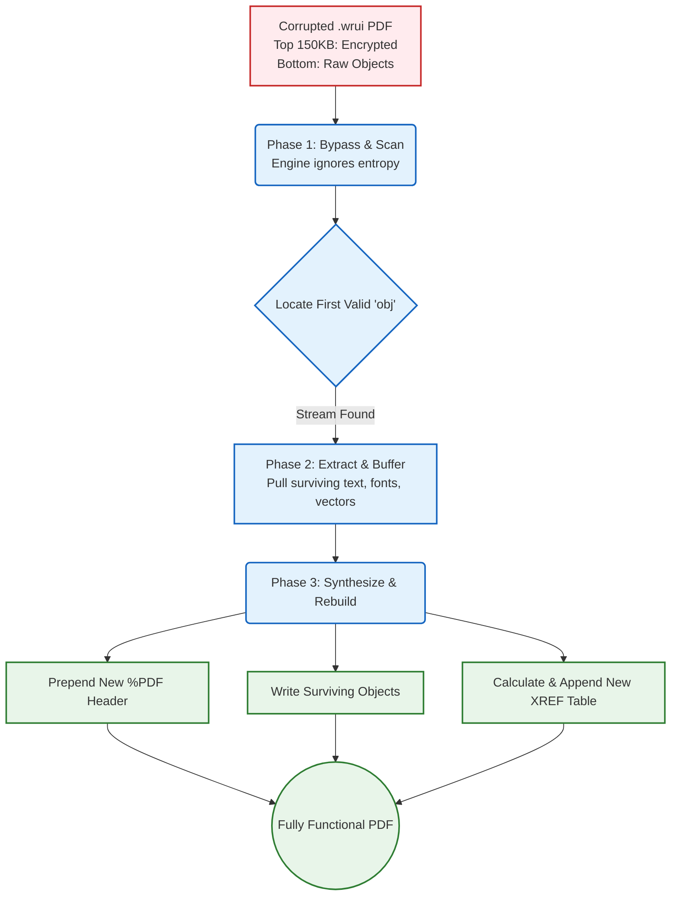

# STOP/Djvu Ransomware (.wrui) Forensics & Partial Data Recovery

A technical exploration and data carving project demonstrating a vulnerability/flaw in the payload delivery of the **STOP/Djvu (.wrui) ransomware variant (2021)**. This project highlights a method to salvage partial document data after encryption without paying the ransom.

## 📌 Project Overview
When dealing with online/server-side cryptographic keys, universal decryption is mathematically impossible without the private key. However, this project focuses on a structural flaw in the malware's encryption strategy rather than a cryptographic break.

To maximize execution speed, the ransomware only encrypts the initial block (typically the first 150KB to 5MB) of larger files, leaving the remaining payload completely raw but structurally orphaned.

---

## 🛡️ Featured Research: STOP/Djvu (.wrui) Forensics & Data Carving

**Repository:** [shubhamd211/ransomware-incident-response-wrui](https://github.com/shubhamd211/ransomware-incident-response-wrui)  
**Domain:** Digital Forensics, Malware Behavioral Analysis, Binary Data Carving

* **The Problem:** The STOP/Djvu ransomware family leverages server-side cryptographic keys, making mathematical decryption impossible once deployed.
* **The Vulnerability:** To accelerate execution, the payload employs partial file encryption, scrambling only the initial block (150 KB to 5 MB) while leaving subsequent document byte streams untouched and recoverable.
* **The Solution:** Engineered a raw binary extraction pipeline using:
  * **Entropy Mapping:** Pinpointing exact transition points between high-entropy (encrypted) headers and low-entropy (raw) payloads.
  * **PDF Stream Reconstruction:** Bypassing stripped XREF tables and forcing tolerant parsers to render surviving object streams.
  * **OpenXML Schema Carving:** Extracting surviving compressed XML packets directly from corrupted ZIP container envelopes.
* **Result:** Salvaged up to 50% of compromised enterprise documents without ransom interaction.

---

## 🔬 Technical Insight & Flaw Exploitation

The recovery methodology relies on analyzing how the malware interfaces with different document structures:

### 1. File-Specific Encryption Profiles
* **High-Volume / Large Documents (.pdf):** The ransomware scrambles the file header and cross-reference tables (XREF) at the beginning of the file. However, the body text streams, fonts, and object contents often remain intact beyond the encrypted prefix.
* **OpenXML Archives (.docx, .xlsx, .pptx):** Modern Microsoft Office assets are zipped XML infrastructures. While the main ZIP header is corrupted, individual internal XML structural fragments (contained within the archive) can often be extracted and reassembled.

### 2. The Recovery Pipeline
The extraction process bypasses the operating system's default file parsers (which throw corruption errors due to missing headers) by treating the data as raw binary streams:
1. **Entropy Analysis:** Mapping the file to identify where the high-entropy (encrypted) block ends and low-entropy (unencrypted raw data) begins.
2. **Binary Carving:** Stripping the corrupted encryption block from the file.
3. **Container Rebuilding:** 
   * For **PDFs**: Re-indexing surviving object streams and forcefully rendering pages via tolerant layout engines.
   * For **Office Docs**: Re-assembling fragmented XML data blocks into clean, readable text schemas.

### ⚙️ Automated Stream Re-indexing vs. Manual Carving
While manual hex-editing is effective for targeted recovery, STOP/Djvu PDF stream reconstruction can be automated by passing the partially encrypted payloads through tolerant PDF repair engines (e.g., Ghostscript-based parsers or commercial API engines). 

Standard PDF readers (like Adobe) halt execution upon encountering a high-entropy, corrupted `%PDF-1.x` header. Automated forensic repair tools bypass this by scanning past the 150 KB blast radius, isolating surviving `obj` streams, and synthesizing a brand-new file envelope around the surviving data.

#### PDF Reconstruction State Transition
*The flowchart below illustrates how an automated engine bypasses the STOP/Djvu encryption boundary to rebuild the document structure.*

**Forensic Note:** This achieves 100% functional data salvage, but only a partial byte recovery. The original file metadata, initial catalogs, and top-level fonts destroyed in the first 150 KB are permanently lost, but modern PDF renderers tolerate these omissions by falling back to system defaults.

---

## 🛠️ Skills Demonstrated
* **Digital Forensics & Incident Response (DFIR)**
* **Data Carving & Binary Stream Manipulation**
* **Malware Behavior Analysis** (STOP/Djvu family profiles)
* **File System Structural Reconstructions** (Hex editing, OpenXML schema manipulation, PDF XREF structural repair)
* **Memory Forensics & Live Process Analysis**

---

## 📈 Future Scope / Contributions
* Automation scripts to automatically detect the encryption boundary based on byte entropy.
* Automated extraction pipelines for batch-repairing salvaged `.wrui` documentation.

### ⚠️ The Cryptographic Roadblock: Online vs. Offline Keys
Initial remediation attempts followed standard industry playbooks, utilizing tools like the Emsisoft STOP Djvu Decryptor. However, behavioral analysis via ANY.RUN revealed that the malware successfully used an **Online ID** infection pattern.

This resulted in an **Online ID** infection. Unlike Offline ID infections (which rely on a hardcoded, crackable key), an Online ID generates a unique RSA-2048 key pair per victim, with the private key stored remotely by the attacker. Because mathematical decryption is impossible without this private key, traditional decryption workflows failed. This failure necessitated a pivot from **Cryptographic Reversal** to **Binary Data Carving** and forensic reconstruction.

### 🗺️ MITRE ATT&CK TTP Mapping
* **[TA0002] Execution:** Command and Scripting Interpreter (T1059)
* **[TA0040] Impact:** Data Encrypted for Impact (T1486)
* **[TA0040] Impact:** Inhibit System Recovery (T1490) - *Shadow Copy Deletion*
* **[TA0011] Command and Control:** Application Layer Protocol (T1071) - *Online ID Key Retrieval*

---

### 🧠 Memory Forensics & Live Process Analysis
To map the malware's execution flow before it locked the file system, the payload was detonated in an isolated Windows environment. Standard static analysis is insufficient because STOP/Djvu variants frequently pack their payloads to evade signature-based detection.

**1. Live OS Process Monitoring (Sysinternals Suite)**
* **Process Explorer / Hacker:** Tracked the initial execution of the `.wrui` dropper, monitoring it as it unpacked its payload into memory and spawned child processes to bypass Windows Defender.
* **Process Monitor (Procmon):** Captured real-time file system and registry activity. This definitively logged the malware's attempt to achieve persistence via `Run` registry keys and its execution of `vssadmin.exe Delete Shadows /All /Quiet` to destroy local backups.

**2. Volatility Framework (Memory Forensics)**
A memory dump (`.mem`) of the infected machine was captured during the encryption phase and analyzed offline using **Volatility 3**.
* **Process Hollowing Detection (`windows.malfind`):** Scanned memory structures to identify injected code and hidden threads where the unpacked ransomware was operating out of legitimate Windows processes.
* **Network Artifact Extraction (`windows.netscan`):** Extracted the live socket connections from RAM, isolating the exact IP addresses used by the malware to negotiate the Online ID RSA-2048 key exchange with its C2 server.

---

*Disclaimer: This repository is intended strictly for educational, data forensics, and security research purposes.*
